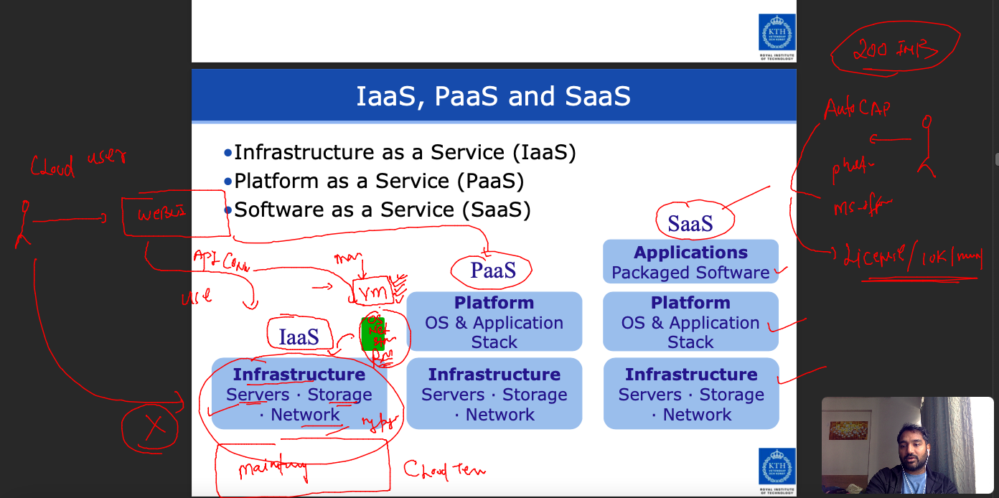

## lets get started 

### targeting things 


### app testing / deployment problems in your Past 


### Introduction virtualization using Hypervisor tech -- 


### type of hypervisor 


### list of t1 & t2 


## Introduction to cloud computing delivery model services 


### understanding  delivery model in detail



### public vs private cloud deployment models 


---

### private 


## users / accounts in cloud env


## Understanding Cloud Regions 


### understanding av zones under particular region 


### lets connect linux vm from mac client 

```
fire@ashutoshhs-MacBook-Air ~ % ls  -l  Downloads/ashu-cisco-private-key.pem 
-rw-r--r--@ 1 fire  staff  1674 Dec 12 12:53 Downloads/ashu-cisco-private-key.pem
fire@ashutoshhs-MacBook-Air ~ % 
fire@ashutoshhs-MacBook-Air ~ % chmod 400 Downloads/ashu-cisco-private-key.pem 
fire@ashutoshhs-MacBook-Air ~ % 
fire@ashutoshhs-MacBook-Air ~ % ssh -i Downloads/ashu-cisco-private-key.pem  ec2-user@3.86.138.22  
The authenticity of host '3.86.138.22 (3.86.138.22)' can't be established.
ECDSA key fingerprint is SHA256:JpCRBgvtv3buDMAjCgEwH0ZUgk5gVxaKgqzFmTHi8yI.
Are you sure you want to continue connecting (yes/no/[fingerprint])? yes
Warning: Permanently added '3.86.138.22' (ECDSA) to the list of known hosts.

       __|  __|_  )
       _|  (     /   Amazon Linux 2 AMI
      ___|\___|___|

https://aws.amazon.com/amazon-linux-2/
19 package(s) needed for security, out of 31 available
Run "sudo yum update" to apply all updates.
-bash: warning: setlocale: LC_CTYPE: cannot change locale (UTF-8): No such file or directory
[ec2-user@ip-172-31-88-17 ~]$ whoam
-bash: whoam: command not found
[ec2-user@ip-172-31-88-17 ~]$ whoami
ec2-user
[ec2-user@ip-172-31-88-17 ~]$ uname 
Linux
[ec2-user@ip-172-31-88-17 ~]$ uname -r
5.10.147-133.644.amzn2.x86_64
[ec2-user@ip-172-31-88-17 ~]$ 

```

### Scaling concept for VM in cloud Env 


### sample webappliction -- lets deploy that in running linux VM 

### login to vm and clone sample application 

```
fire@ashutoshhs-MacBook-Air ~ % ssh -i Downloads/ashu-cisco-private-key.pem ec2-user@54.146.181.193
The authenticity of host '54.146.181.193 (54.146.181.193)' can't be established.
ECDSA key fingerprint is SHA256:JpCRBgvtv3buDMAjCgEwH0ZUgk5gVxaKgqzFmTHi8yI.
Are you sure you want to continue connecting (yes/no/[fingerprint])? yes
Warning: Permanently added '54.146.181.193' (ECDSA) to the list of known hosts.
Last login: Mon Dec 12 09:15:48 2022 from 103.59.75.32

       __|  __|_  )
       _|  (     /   Amazon Linux 2 AMI
      ___|\___|___|

https://aws.amazon.com/amazon-linux-2/
19 package(s) needed for security, out of 31 available
Run "sudo yum update" to apply all updates.
-bash: warning: setlocale: LC_CTYPE: cannot change locale (UTF-8): No such file or directory
[ec2-user@ip-172-31-88-17 ~]$ 
[ec2-user@ip-172-31-88-17 ~]$ 
[ec2-user@ip-172-31-88-17 ~]$ 
[ec2-user@ip-172-31-88-17 ~]$ whoami
ec2-user
[ec2-user@ip-172-31-88-17 ~]$ sudo -i
[root@ip-172-31-88-17 ~]# git clone  https://github.com/yenchiah/project-website-template.git
-bash: git: command not found
[root@ip-172-31-88-17 ~]# yum install git -y 


```

### clone webapp code 

```
[root@ip-172-31-88-17 ~]# yum install git -y 
Failed to set locale, defaulting to C
Loaded plugins: extras_suggestions, langpacks, priorities, update-motd
Package git-2.38.1-1.amzn2.0.1.x86_64 already installed and latest version
Nothing to do
[root@ip-172-31-88-17 ~]# git clone https://github.com/yenchiah/project-website-template.git
Cloning into 'project-website-template'...
remote: Enumerating objects: 1025, done.
remote: Total 1025 (delta 0), reused 0 (delta 0), pack-reused 1025
Receiving objects: 100% (1025/1025), 1.64 MiB | 27.97 MiB/s, done.
Resolving deltas: 100% (633/633), done.
[root@ip-172-31-88-17 ~]# ls
project-website-template
[root@ip-172-31-88-17 ~]# 
```

### lets deploy web app using httpd server 

```
5  git clone https://github.com/yenchiah/project-website-template.git
    6  ls
    7  ls  project-website-template/
    8  ls
    9  ls   project-website-template
   10  yum install  httpd -y 
   11  history 
[root@ip-172-31-88-17 ~]# ls
project-website-template
[root@ip-172-31-88-17 ~]# cp -rf  project-website-template/*   /var/www/html/
[root@ip-172-31-88-17 ~]# systemctl start  httpd
[root@ip-172-31-88-17 ~]# systemctl status httpd
● httpd.service - The Apache HTTP Server
   Loaded: loaded (/usr/lib/systemd/system/httpd.service; disabled; vendor preset: disabled)
   Active: active (running) since Mon 2022-12-12 11:18:15 UTC; 4s ago
     Docs: man:httpd.service(8)
 Main PID: 3688 (httpd)
   Status: "Processing requests..."
   CGroup: /system.slice/httpd.service
           ├─3688 /usr/sbin/httpd -DFOREGROUND
           ├─3689 /usr/sbin/httpd -DFOREGROUND

```


