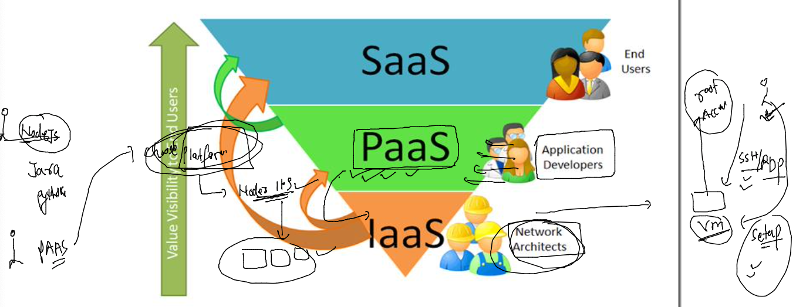
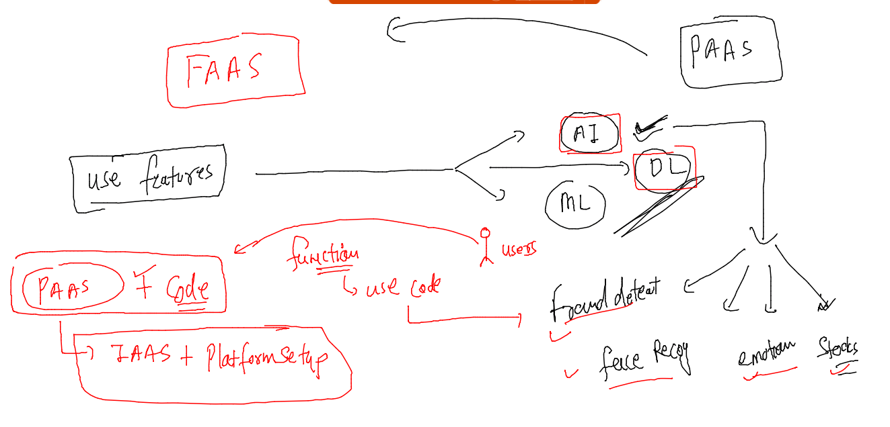
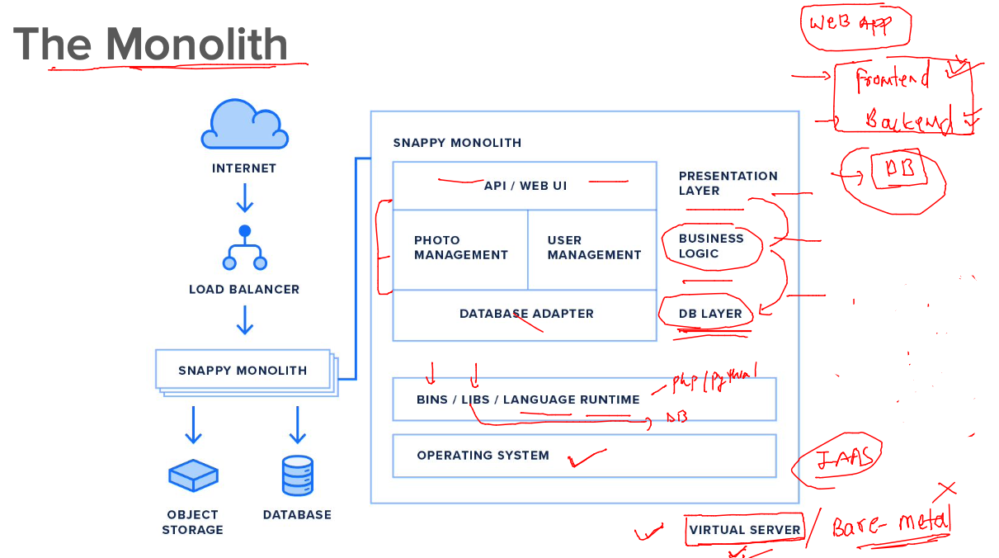
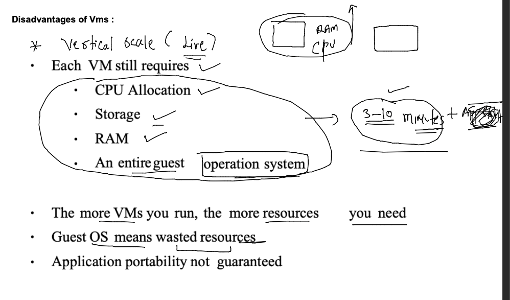

## lets get started 

### Introduction to PAAS



### FAAS 


 

### Introduction to MonoLith app design and deployment 



## breaking Mono-lith -- intro micro components or services 


### Micro services as component in VM -- gonna give below problems 



### journey to containers & introduction to CAAS


### Introduction to containers vs vm 


### Introduction CRE -- container runtime Engine 


### installing docker engine in amazon vm 

```
[ec2-user@ip-172-31-31-82 ~]$ sudo -i
[root@ip-172-31-31-82 ~]# 
[root@ip-172-31-31-82 ~]# 
[root@ip-172-31-31-82 ~]# yum  install docker -y 
Failed to set locale, defaulting to C
Loaded plugins: extras_suggestions, langpacks, priorities, update-motd
Resolving Dependencies
--> Running transaction check
---> Package docker.x86_64 0:20.10.17-1.amzn2.0.1 will be installed
--> Processing Dependency: runc >= 1.0.0 for package: docker-20.10.17-1.amzn2.0.1.x86_64
--> Processing Dependency: libcgroup >= 0.40.rc1-5.15 for package: docker-20.10.17-1.amzn2.0.1.x86_64
--> Processing Dependency: containerd >= 1.3
```

### starting docker engine 

```
[root@ip-172-31-31-82 ~]# systemctl start docker 
[root@ip-172-31-31-82 ~]# systemctl status docker 
● docker.service - Docker Application Container Engine
   Loaded: loaded (/usr/lib/systemd/system/docker.service; disabled; vendor preset: disabled)
   Active: active (running) since Tue 2022-12-13 09:37:57 UTC; 4s ago
     Docs: https://docs.docker.com
  Process: 3656 ExecStartPre=/usr/libexec/docker/docker-setup-runtimes.sh (code=exited, status=0/SUCCESS)
  Process: 3653 ExecStartPre=/bin/mkdir -p /run/docker (code=exited, status=0/SUCCESS)
 Main PID: 3658 (dockerd)
    Tasks: 8
   Memory: 22.5M
   CGroup: /system.slice/docker.service
           └─3658 /usr/bin/dockerd -H fd:// --containerd=/run/containerd/containerd.sock --default-ulimit nofile=32768:65...

Dec 13 09:37:55 ip-172-31-31-82.ec2.internal dockerd[3658]: time="2022-12-13T09:37:55.265005043Z" level=info msg="Cli...grpc
Dec 13 09:37:56 ip-172-31-31-82.ec2.internal dockerd[3658]: time="2022-12-13T09:37:56.639216690Z" level=warning msg="...ght"
Dec 13 09:37:56 ip-172-31-31-82.ec2.internal dockerd[3658]: time="2022-12-13T09:37:56.639259746Z" level=warning msg="...ice"
Dec 13 09:37:56 ip-172-31-31-82.ec2.internal dockerd[3658]: time="2022-12-13T09:37:56.639452817Z" level=info msg="Loa...rt."
Dec 13 09:37:57 ip-172-31-31-82.ec2.internal dockerd[3658]: time="2022-12-13T09:37:57.158898507Z" level=info msg="Def...ess"
Dec 13 09:37:57 ip-172-31-31-82.ec2.internal dockerd[3658]: time="2022-12-13T09:37:57.237077419Z" level=info msg="Loa...ne."
Dec 13 09:37:57 ip-172-31-31-82.ec2.internal dockerd[3658]: time="2022-12-13T09:37:57.251812219Z" level=info msg="Doc...0.17
Dec 13 09:37:57 ip-172-31-31-82.ec2.internal dockerd[3658]: time="2022-12-13T09:37:57.251909601Z" level=info msg="Dae...ion"
Dec 13 09:37:57 ip-172-31-31-82.ec2.internal systemd[1]: Started Docker Application Container Engine.
Dec 13 09:37:57 ip-172-31-31-82.ec2.internal dockerd[3658]: time="2022-12-13T09:37:57.279133681Z" level=info msg="API...ock"
Hint: Some lines were ellipsized, use -l to show in full.
[root@ip-172-31-31-82 ~]# systemctl enable docker 
Created symlink from /etc/systemd/system/multi-use
```

### creating users and giving access of docker 

```
[root@ip-172-31-31-82 ~]# for i  in ashu ashish bhushan manish rameez naga navneet nikitha sameer vijay 
> do
> useradd $i
> echo "CiscoCn@098#"  |  passwd $i --stdin 
> usermod -aG docker $i 
> done 
Changing password for user ashu.
passwd: all authentication tokens updated successfully.
Changing password for user ashish.
passwd: all authentication tokens updated successfully.
Changing password for user bhushan.
passwd: all authentication tokens updated successfully.
Changing password for user manish.
passwd: all authentication tokens updated successfully.
Changing password for user rameez.
passwd: all authentication tokens updated successfully.
```

### access docker from non root user 

```
[ashu@ip-172-31-31-82 ~]$ whoami
ashu
[ashu@ip-172-31-31-82 ~]$ docker  version 
Client:
 Version:           20.10.17
 API version:       1.41
 Go version:        go1.18.6
 Git commit:        100c701
 Built:             Wed Sep 28 23:10:17 2022
 OS/Arch:           linux/amd64
 Context:           default
 Experimental:      true

Server:
 Engine:
  Version:          20.10.17
  API version:      1.41 (minimum version 1.12)
  Go version:       go1.18.6
  Git commit:       a89b842
  Built:            Wed Sep 28 23:10:55 2022
  OS/Arch:          linux/amd64
  Experimental:     false
 containerd:
  Version:          1.6.8
  GitCommit:        9cd3357b7fd7218e4aec3eae239db1f68a5a6ec6
 runc:
  Version:          1.1.4
  GitCommit:        5fd4c4d144137e991c4acebb2146ab1483a97925
 docker-init:

```

### COntainerization of application 


