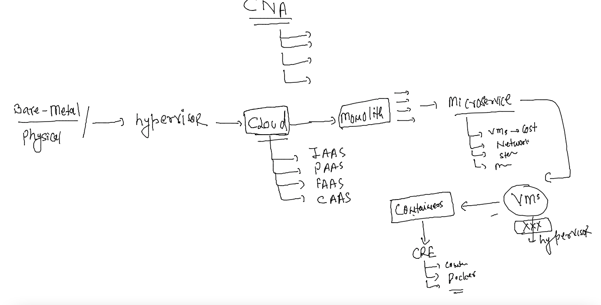
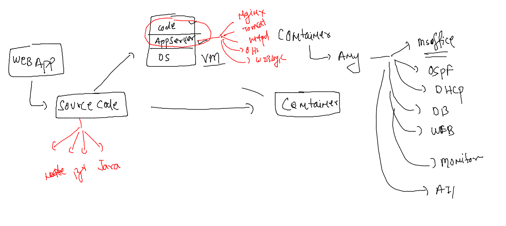
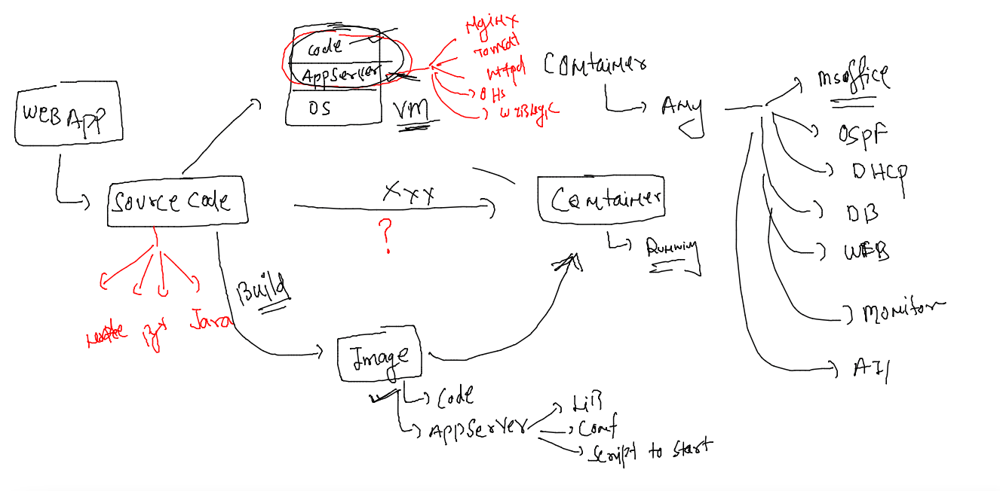

## Revision 



### app containerization 



### source code to image -- containers 



### lets build our first image for simple webapp 

```
[ashu@ip-172-31-31-82 ashu-microservices-apps]$ ls
html-sample-app  project-website-template
[ashu@ip-172-31-31-82 ashu-microservices-apps]$ docker  build  -t  ashuwebapp:1.0 html-sample-app/ 
Sending build context to Docker daemon   3.63MB
Step 1/4 : FROM nginx
latest: Pulling from library/nginx
025c56f98b67: Pull complete 
ec0f5d052824: Pull complete 
cc9fb8360807: Pull complete 
defc9ba04d7c: Pull complete 
885556963dad: Pull complete 
f12443e5c9f7: Pull complete 
Digest: sha256:75263be7e5846fc69cb6c42553ff9c93d653d769b94917dbda71d42d3f3c00d3
Status: Downloaded newer image for nginx:latest
 ---> 3964ce7b8458
Step 2/4 : LABEL name=ashutoshh
 ---> Running in 1188f56fb92e
Removing intermediate container 1188f56fb92e
 ---> 22ee66a8fb9b
Step 3/4 : LABEL email=ashutoshh@linux.com
 ---> Running in 7bb2ec1e2cef
Removing intermediate container 7bb2ec1e2cef
 ---> 6f33ed975965
Step 4/4 : COPY .  /usr/share/nginx/html/
 ---> 6eb142224809
Successfully built 6eb142224809
Successfully tagged ashuwebapp:1.0
[ashu@ip-172-31-31-82 ashu-microservices-apps]$ docker  images
REPOSITORY   TAG       IMAGE ID       CREATED          SIZE
ashuwebapp   1.0       6eb142224809   28 seconds ago   145MB
nginx        latest    3964ce7b8458   4 hours ago      142MB
[ashu@ip-172-31-31-82 ashu-microservices-apps]$ 
```


