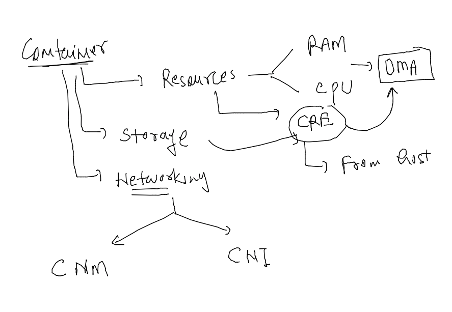
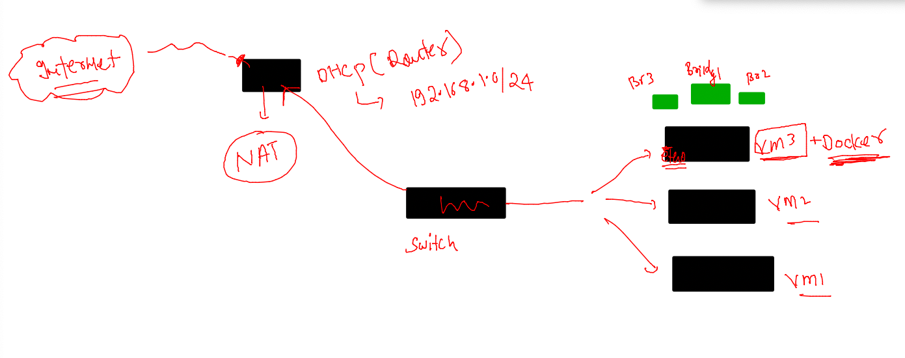
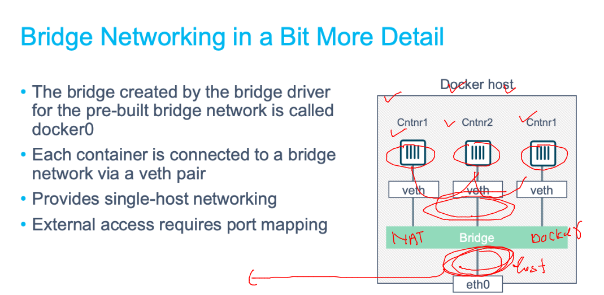
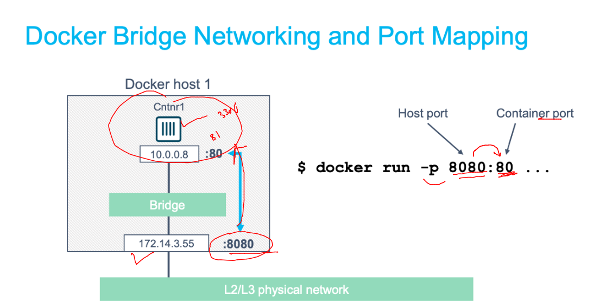
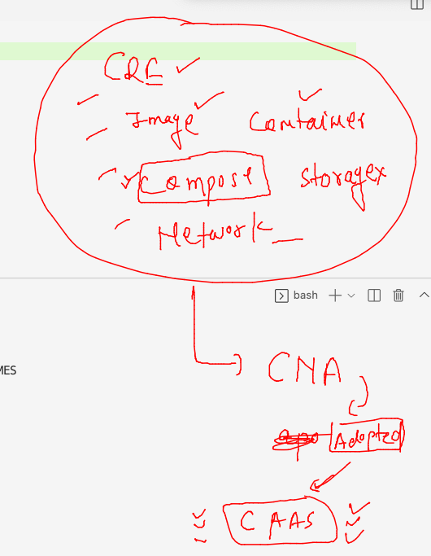

## Revision 


### app containerization 


### source code to image -- containers 


### lets build our first image for simple webapp 

```
[ashu@ip-172-31-31-82 ashu-microservices-apps]$ ls
html-sample-app  project-website-template
[ashu@ip-172-31-31-82 ashu-microservices-apps]$ docker  build  -t  ashuwebapp:1.0 html-sample-app/ 
Sending build context to Docker daemon   3.63MB
Step 1/4 : FROM nginx
latest: Pulling from library/nginx
025c56f98b67: Pull complete 
ec0f5d052824: Pull complete 
cc9fb8360807: Pull complete 
defc9ba04d7c: Pull complete 
885556963dad: Pull complete 
f12443e5c9f7: Pull complete 
Digest: sha256:75263be7e5846fc69cb6c42553ff9c93d653d769b94917dbda71d42d3f3c00d3
Status: Downloaded newer image for nginx:latest
 ---> 3964ce7b8458
Step 2/4 : LABEL name=ashutoshh
 ---> Running in 1188f56fb92e
Removing intermediate container 1188f56fb92e
 ---> 22ee66a8fb9b
Step 3/4 : LABEL email=ashutoshh@linux.com
 ---> Running in 7bb2ec1e2cef
Removing intermediate container 7bb2ec1e2cef
 ---> 6f33ed975965
Step 4/4 : COPY .  /usr/share/nginx/html/
 ---> 6eb142224809
Successfully built 6eb142224809
Successfully tagged ashuwebapp:1.0
[ashu@ip-172-31-31-82 ashu-microservices-apps]$ docker  images
REPOSITORY   TAG       IMAGE ID       CREATED          SIZE
ashuwebapp   1.0       6eb142224809   28 seconds ago   145MB
nginx        latest    3964ce7b8458   4 hours ago      142MB
[ashu@ip-172-31-31-82 ashu-microservices-apps]$ 
```

## to create containers -- we need things 



### creating container 

```
[ashu@ip-172-31-31-82 ashu-microservices-apps]$ docker run -d --name ashuappc1 -p 1234:80  ashuwebapp:1.0 
e11bc8c63a2586da61ec2061992f01b83eb42a8603e6f722a129aea774b18991
[ashu@ip-172-31-31-82 ashu-microservices-apps]$ docker ps
CONTAINER ID   IMAGE            COMMAND                  CREATED         STATUS        PORTS                                   NAMES
e11bc8c63a25   ashuwebapp:1.0   "/docker-entrypoint.…"   3 seconds ago   Up 1 second   0.0.0.0:1234->80/tcp, :::1234->80/tcp   ashuappc1
```

### Container networking 



### checking default CNM bridges by docker 

```
[ashu@ip-172-31-31-82 ashu-microservices-apps]$ docker  network  ls
NETWORK ID     NAME      DRIVER    SCOPE
2bdd732d1ae7   bridge    bridge    local
144a88b41bb1   host      host      local
1139e95a707e   none      null      local
```

### checking containers connected in default bridge

```
[ashu@ip-172-31-31-82 ashu-microservices-apps]$ docker  network  inspect  2bdd732d1ae7 
[
    {
        "Name": "bridge",
        "Id": "2bdd732d1ae75035aa9653ecb4fe63263e9170e975dfc300507edf0c17a3a231",
        "Created": "2022-12-14T04:19:10.315772151Z",
        "Scope": "local",
        "Driver": "bridge",
        "EnableIPv6": false,
        "IPAM": {
            "Driver": "default",
            "Options": null,
            "Config": [
                {
                    "Subnet": "172.17.0.0/16",
                    "Gateway": "172.17.0.1"
                }
            ]
        },
        "Internal": false,
        "Attachable": false,
        "Ingress": false,
        "ConfigFrom": {
            "Network": ""
        },
        "ConfigOnly": false,
        "Containers": {
            "2fed110e27a87d6c0b3b595d22eae54b03fddb6453bcd6b93234cae30aa816cc": {
                "Name": "BhushanCont",
                "EndpointID": "9edde90996f0e8aced1316b996032f75c5caa3d7566b8f72783e2fda391b9ac5",
                "MacAddress": "02:42:ac:11:00:08",
                "IPv4Address": "172.17.0.8/16",
                "IPv6Address": ""
            },
            "3b55d503aae4fda3e6ed09074d6f5f93b6b14e69af307e0d0a78c2d481720c6f": {
                "Name": "nikiappc1",
                "EndpointID": "a71043feb08ba6b2e5c0a3cdb3ef43f6a78bc8ed6c8d438d837c73857c48295c",
                "MacAddress": "02:42:ac:11:00:03",
                "IPv4Address": "172.17.0.3/16",
                "IPv6Address": ""
            },
            "3d4962b99f0f1b5af7b693edada50d3970c221e000b035999415c14e66d76c12": {
                "Name": "vijayapp",
                "EndpointID": "66680ac320dd60ad777e9145da870340358179efef81de8c4571b4870a7666bd",
                "MacAddress": "02:42:ac:11:00:0a",
                "IPv4Address": "172.17.0.10/16",
                "IPv6Address": ""
            },
            "640c831e3ebc02280917e5eac8c51fae7d474731649568f522b79c188b7d34b7": {
                "Name": "naga_container",
                "EndpointID": "5332dea6bf5076a1436bf9eb70b88b3123c063d37a1cdb716832f75160f0a6bd",
                "MacAddress": "02:42:ac:11:00:07",
                "IPv4Address": "172.17.0.7/16",
                "IPv6Address": ""
            },
            "6f6d3da0394ca0291c869e86b1e2d423e375f3a341e4ea5c6e568e8cc5907d19": {
                "Name": "manish-cont1",
                "EndpointID": "7701cce388140a80754e60a5b14f7aa83986a7ec4bf3d7f059adf513a86510f8",
                "MacAddress": "02:42:ac:11:00:05",
                "IPv4Address": "172.17.0.5/16",
                "IPv6Address": ""
            },
            "817d9236ac47d308d4255271bc417d36a3cea1222b9ed05375b90b7656b3d191": {
                "Name": "sameerCont",
                "EndpointID": "fccbf6152d9ac22ae61fac33c67fbcd44b9c031e30ccd79eb398e62254a4aa0b",
                "MacAddress": "02:42:ac:11:00:09",
                "IPv4Address": "172.17.0.9/16",
                "IPv6Address": ""
            },
            "8a0f267b28d6385b7fd6a407569026584da800242bb7a9d8b261778154cfbab0": {
                "Name": "navneetapppc1",
                "EndpointID": "ead1b0a14f28569ddc247a3f53d971d0e086fc5d69a5bb4a5dba78e2f1397e17",
                "MacAddress": "02:42:ac:11:00:06",
                "IPv4Address": "172.17.0.6/16",
                "IPv6Address": ""
            },
            "e11bc8c63a2586da61ec2061992f01b83eb42a8603e6f722a129aea774b18991": {
                "Name": "ashuappc1",
                "EndpointID": "017943283a9d4bd7426ce93f6a3eca2068d6bf1a43c805edb2b68b1a5624a38e",
                "MacAddress": "02:42:ac:11:00:02",
                "IPv4Address": "172.17.0.2/16",
                "IPv6Address": ""
            },
            "e6cf12042219dde6533324da49ae840de43b57d1a9b8b5c397d2333600562219": {
                "Name": "ashishappv1",
                "EndpointID": "a2e8c2df10c732d6fe2cdf46d0aceeda96f900ba0c057dd01d9ed2068b42ff90",
                "MacAddress": "02:42:ac:11:00:04",
                "IPv4Address": "172.17.0.4/16",
                "IPv6Address": ""
```

### more detail understanding 



### port mapping 



## CAAS understanding 



### running micro services using compose 

### file 

```
version: '3.8'
services:
  ashuapp-ui:
    image: ashuwebapp:uiv1 
    build: # to build image what we need 
      context: html-sample-app
      dockerfile: Dockerfile
    container_name: ashuweb-uic1  # name of container 
    ports: # implementing port forwarding 
    - "1234:80"
  
```

### run it 

```
[ashu@ip-172-31-31-82 ashu-microservices-apps]$ ls
docker-compose.yaml  html-sample-app  project-website-template
[ashu@ip-172-31-31-82 ashu-microservices-apps]$ docker-compose  up  -d 
[+] Running 0/0
 ⠿ ashuapp-ui Warning                                                                                                             0.1s
[+] Building 4.9s (6/7)                                                                                                                
 => [internal] load build definition from Dockerfile                                                                              0.0s
 => => transferring dockerfile: 132B                                                                                              0.0s
 => [internal] load .dockerignore                                                                                                 0.0s
 => => transferring context: 2B                                                                                                   0.0s
 => [internal] load metadata for docker.io/library/nginx:latest                                                                   0.3s
 => [1/2] FROM docker.io/library/nginx@sha256:75263be7e5846fc69cb6c42553ff9c93d653d769b94917dbda71d42d3f3c00d3                    4.5s
 => => resolve docker.io/library/nginx@sha256:75263be7e5846fc69cb6c42553ff9c93d653d769b94917dbda71d42d3f3c00d3                    0.0s
 => => sha256:75263be7e5846fc69cb6c42553ff9c93d653d769b94917dbda71d42d3f3c00d3 1.86kB / 1.86kB                                    0.0s
 => => sha256:d586384381a0e6834cef73d432b1486f0b86334cb92e54256def62dd403f82ab 1.57kB / 1.57kB                                    0.0s
 => => sha256:cc9fb83608079826a2253ad790b97fbbabf255892662a404fc393cde628fc9be 627B / 627B                                        0.1s
 => => sha256:defc9ba04d7ce5f07366e26ef7137cf13a79075c5e050706958385a14617b074 958B / 958B                                        0.1s
 => => sha256:3964ce7b84589cf9bc585415741b642b7167229e0afde03f502f6c848ed3279d 7.65kB / 7.65kB                                    0.0s
 => => sha256:025c56f98b679f70b7a54241917e56da7b59ab9d2defecc6ebdb0bf2750484bb 31.41MB / 31.41MB                                  1.2s
 => => sha256:ec0f5d052824ff7c7ced18ba6f567d4aab54bb759541a2eee203f8963f5d9437 25.47MB / 25.47MB                                  0.7s
 => => sha256:885556963dada8f21475e2b816fcc9086ef9417bcac857dd5c3c16280bc83b49 774B / 774B                                        0.2s
 => => sha256:f12443e5c9f73965a80b47c0e843784149af7434e307a4a69978bba1dc97c7db 1.40kB / 1.40kB                                    0.2s
 => => extracting sha256:025c56f98b679f70b7a54241917e56da7b59ab9d2defecc6ebdb0bf2750484bb                                         1.3s
 => => extracting sha256:ec0f5d052824ff7c7ced18ba6f567d4aab54bb759541a2eee203f8963f5d9437                                         0.7s
 => => extracting sha256:cc9fb83608079826a2253ad790b97fbbabf255892662a404fc393cde628fc9be                                         0.0s
 => => extracting sha256:defc9ba04d7ce5f07366e26ef7137cf13a79075c5e050706958385a14617b074                                         0.0s
 => => extracting sha256:885556963dada8f21475e2b816fcc9086ef9417bcac857dd5c3c16280bc83b49                                         0.0s
 => => extracting sha256:f12443e5c9f73965a80b47c0e843784149af7434e307a4a69978bba1dc97c7db                                         0.0s
 => [internal] load build context                                                                                                 0.1s
 => => transferring context: 3.55MB                                                                                               0.1s
 => [2/2] COPY .  /usr/share/nginx/html/                                                                                          0.5s
 => exporting to image                                                                                                            0.1s
 => => exporting layers                                                                                                           0.0s
 => => writing image sha256:4c8bab2153831937646329253da44ce533f0c17447cea491bde964855503bddb                                      0.0s
 => => naming to docker.io/library/ashuwebapp:uiv1                                                                                0.0s
[+] Running 2/2
 ⠿ Network ashu-microservices-apps_default  Created                                                                               0.0s
 ⠿ Container ashuweb-uic1                   Started           
```


### listing 

```
[ashu@ip-172-31-31-82 ashu-microservices-apps]$ docker-compose  ps
NAME                COMMAND                  SERVICE             STATUS              PORTS
ashuweb-uic1        "/docker-entrypoint.…"   ashuapp-ui          running             0.0.0.0:1234->80/tcp, :::1234->80/tcp
[ashu@ip-172-31-31-82 ashu-microservices-apps]$ 
```

### adding db service in compose 

```
version: '3.8'
services:
  ashuapp-db: # database service 
    image: mysql
    container_name: ashudbc1
    environment:
      MYSQL_ROOT_PASSWORD: "CiscoDb@098"
  ashuapp-ui:
    image: ashuwebapp:uiv1 
    build: # to build image what we need 
      context: html-sample-app
      dockerfile: Dockerfile
    container_name: ashuweb-uic1  # name of container 
    ports: # implementing port forwarding 
    - "1234:80"
  
```

### lets run it again 

```
[ashu@ip-172-31-31-82 ashu-microservices-apps]$ ls
docker-compose.yaml  html-sample-app  project-website-template
[ashu@ip-172-31-31-82 ashu-microservices-apps]$ docker-compose up -d
[+] Running 12/12
 ⠿ ashuapp-db Pulled                                                                                                              9.6s
   ⠿ 0ed027b72ddc Pull complete                                                                                                   3.1s
   ⠿ 0296159747f1 Pull complete                                                                                                   3.2s
   ⠿ 3d2f9b664bd3 Pull complete                                                                                                   3.3s
   ⠿ df6519f81c26 Pull complete                                                                                                   3.5s
   ⠿ 36bb5e56d458 Pull complete                                                                                                   3.6s
   ⠿ 054e8fde88d0 Pull complete                                                                                                   3.6s
   ⠿ f2b494c50c7f Pull complete                                                                                                   5.2s
   ⠿ 132bc0d471b8 Pull complete                                                                                                   5.3s
   ⠿ 135ec7033a05 Pull complete                                                                                                   9.3s
   ⠿ 5961f0272472 Pull complete                                                                                                   9.3s
   ⠿ 75b5f7a3d3a4 Pull complete                                                                                                   9.4s
[+] Running 2/2
 ⠿ Container ashudbc1      Started                                                                                                4.1s
 ⠿ Container ashuweb-uic1  Running                                                                                                0.0s
[ashu@ip-172-31-31-82 ashu-microservices-apps]$ docker-compose  ps
NAME                COMMAND                  SERVICE             STATUS              PORTS
ashudbc1            "docker-entrypoint.s…"   ashuapp-db          running             3306/tcp, 33060/tcp
ashuweb-uic1        "/docker-entrypoint.…"   ashuapp-ui          running             0.0.0.0:1234->80/tcp, :::1234->80/tcp
[ashu@ip-172-31-31-82 ashu-microservices-apps]$ 
```


