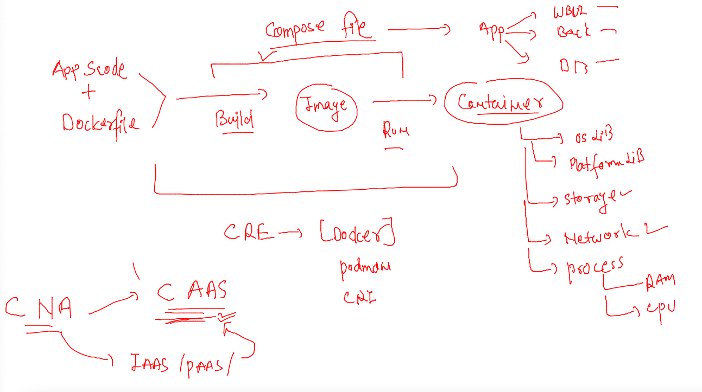
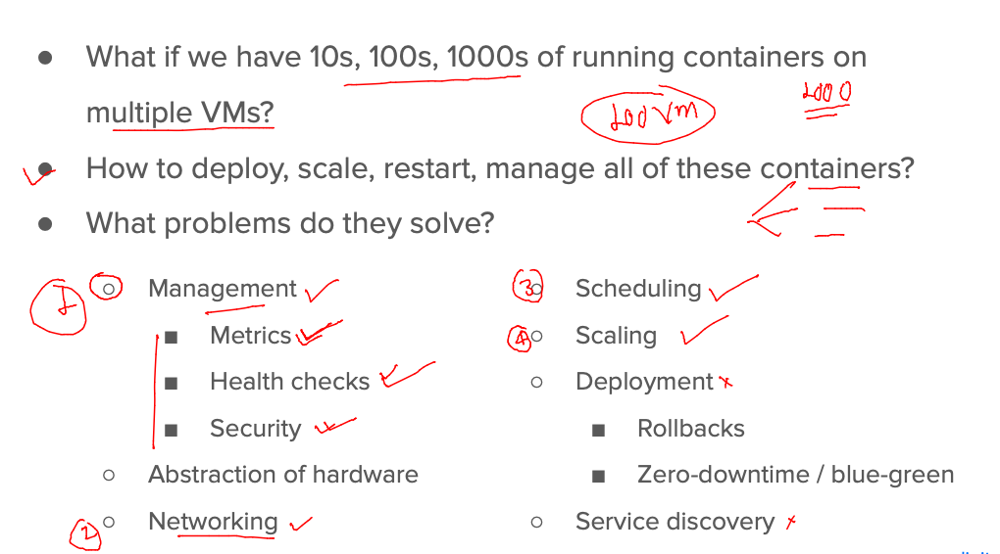
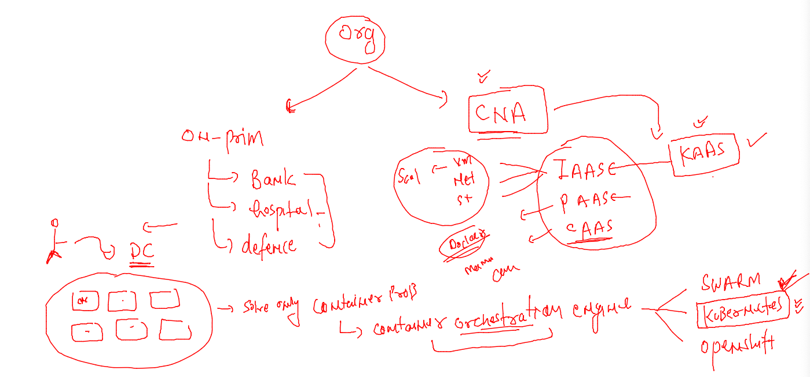
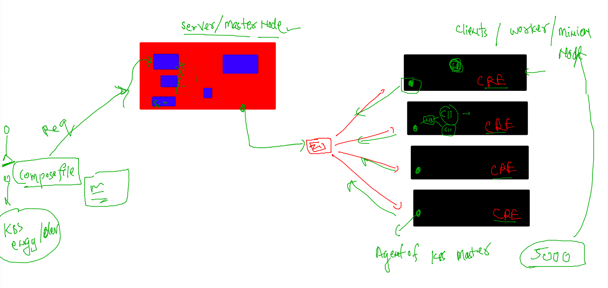
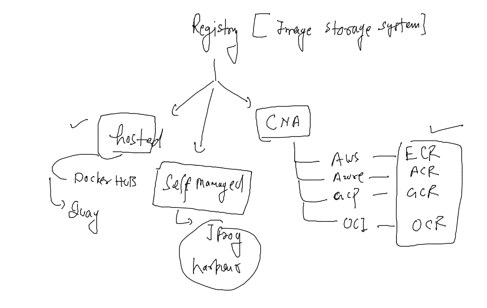
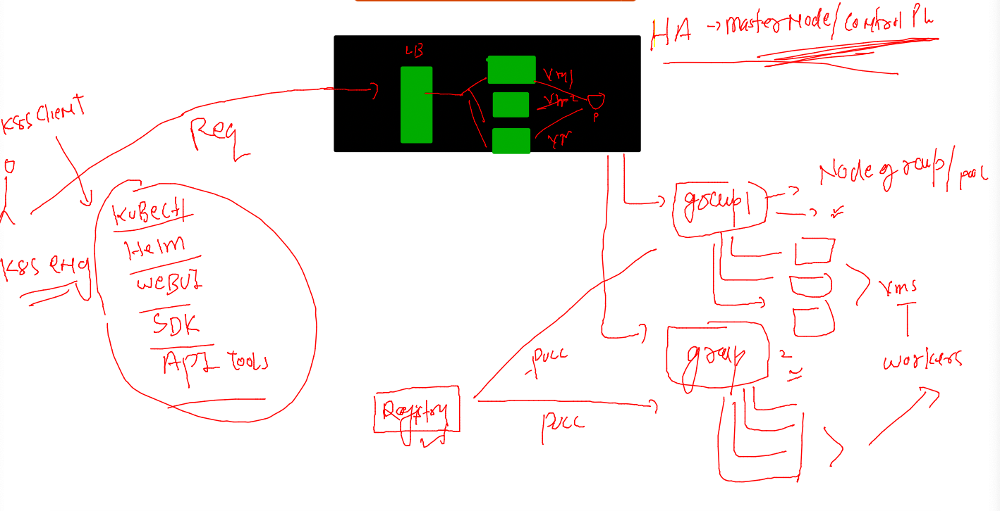

## Revision 



### problem with container clustering option 



### Introduction to KAAS -- Kubernetes as a service in CLoud nativ architecture 



### k8s architecture 



### to store container images 



### pushing container app image to docker hub 

```
ashu@ip-172-31-31-82 ashu-microservices-apps]$ docker images 
REPOSITORY       TAG          IMAGE ID       CREATED        SIZE
ashishapp        imgv1        4df2e572b7b5   22 hours ago   145MB
bhushan          imgv1        240b5a404a42   22 hours ago   145MB
manishwebapp     frontendv1   c43e475a2d3f   23 hours ago   145MB
navneetwebapp    uiv1         fffc8f77e40e   23 hours ago   145MB
vijaywebapp      uiv1         7dbb885828a3   23 hours ago   145MB
sameerappnginx   imgv1        0e5095c90b82   23 hours ago   145MB
nikiwebapp       uiv1         5a45a21bd2e2   23 hours ago   145MB
ashuwebapp       uiv1         4c8bab215383   23 hours ago   145MB
mysql            latest       7484689f290f   8 days ago     538MB
adminer          latest       ef63a68bb1a5   4 weeks ago    91.3MB
[ashu@ip-172-31-31-82 ashu-microservices-apps]$ 
[ashu@ip-172-31-31-82 ashu-microservices-apps]$ docker  tag  ashuwebapp:uiv1   docker.io/dockerashu/ashuwebapp:uiv1 
[ashu@ip-172-31-31-82 ashu-microservices-apps]$ docker login 
Login with your Docker ID to push and pull images from Docker Hub. If you don't have a Docker ID, head over to https://hub.docker.com to create one.
Username: dockerashu
Password: 
WARNING! Your password will be stored unencrypted in /home/ashu/.docker/config.json.
Configure a credential helper to remove this warning. See
https://docs.docker.com/engine/reference/commandline/login/#credentials-store

Login Succeeded

===
ashu@ip-172-31-31-82 ashu-microservices-apps]$ docker  push  docker.io/dockerashu/ashuwebapp:uiv1
The push refers to repository [docker.io/dockerashu/ashuwebapp]
545afc9364bf: Pushed 
e83791f03918: Mounted from library/nginx 
10e506a84718: Mounted from library/nginx 
9485bb85a132: Mounted from library/nginx 
47064e0edc59: Mounted from library/nginx 
5678f6b95362: Mounted from library/nginx 
b5ebffba54d3: Mounted from library/nginx 
uiv1: digest: sha256:9744988c8120279d646b7db5d0ab6c3a92437ddfacb478b8e753aa7b435384c3 size: 1781

==
[ashu@ip-172-31-31-82 ashu-microservices-apps]$ docker logout 
Removing login credentials for https://index.docker.io/v1/
```

### Cloud Nativ k8s servie by amazon -- EKS -- how to connect eks to deploy applications 



### from VS code login to terminal 2 with user 

```
ashu@ip-172-31-31-82 ashu-microservices-apps]$ su - k8s-client 
Password: 
Last login: Thu Dec 15 06:27:38 UTC 2022 on pts/2
[k8s-client@ip-172-31-31-82 ~]$ 
[k8s-client@ip-172-31-31-82 ~]$ whoami
k8s-client
[k8s-client@ip-172-31-31-82 ~]$ kubectl  version --client 
Client Version: version.Info{Major:"1", Minor:"22+", GitVersion:"v1.22.15-eks-fb459a0", GitCommit:"be82fa628e60d024275efaa239bfe53a9119c2d9", GitTreeState:"clean", BuildDate:"2022-10-24T20:36:27Z", GoVersion:"go1.16.15", Compiler:"gc", Platform:"linux/amd64"}
[k8s-client@ip-172-31-31-82 ~]$ 
```

### creating deployment 

```
[k8s-client@ip-172-31-31-82 ~]$ kubectl  create  deployment  ashu-ui-app --image=docker.io/dockerashu/ashuwebapp:uiv1 --port 80 
deployment.apps/ashu-ui-app created
[k8s-client@ip-172-31-31-82 ~]$ kubectl  get  deployment 
NAME          READY   UP-TO-DATE   AVAILABLE   AGE
ashu-ui-app   1/1     1            1           9s
[k8s-client@ip-172-31-31-82 ~]$ 
```

### scaling micro services container horizentally 

```
[k8s-client@ip-172-31-31-82 ~]$ kubectl  scale deployment  ashu-ui-app   --replicas=3
deployment.apps/ashu-ui-app scaled
[k8s-client@ip-172-31-31-82 ~]$ kubectl  get  deploy 
NAME             READY   UP-TO-DATE   AVAILABLE   AGE
ashish-tes-app   1/1     1            1           10m
ashu-ui-app      3/3     3            3           20m
bhushan-ui       1/1     1            1           5m17s
manish-ui-app    1/1     1            1           11m
navneet-ui-app   1/1     1            1           14m
niki-ui-app      1/1     1            1           18m
sameer-app       1/1     1            1           4m2s
vijay-ui-app1    1/1     1            1           5m32s
[k8s-client@ip-172-31-31-82 ~]$ kubectl  get  po -o wide
NAME                              READY   STATUS    RESTARTS   AGE     IP               NODE                            NOMINATED NODE   READINESS GATES
ashish-tes-app-99c5b5545-rsq9p    1/1     Running   0          10m     192.168.50.243   ip-192-168-58-97.ec2.internal   <none>           <none>
ashu-ui-app-77bd9fdcf7-6wp5s      1/1     Running   0          20m     192.168.42.98    ip-192-168-58-97.ec2.internal   <none>           <none>
ashu-ui-app-77bd9fdcf7-8k8fd      1/1     Running   0          13s     192.168.41.255   ip-192-168-58-97.ec2.internal   <none>           <none>
ashu-ui-app-77bd9fdcf7-dndcn      1/1     Running   0          13s     192.168.7.193    ip-192-168-9-119.ec2.internal   <none>           <none>
bhushan-ui-c78f9dc77-9kr4l        1/1     Running   0          5m27s   192.168.54.107   ip-192-168-58-97.ec2.internal   <none>           <none>
```


